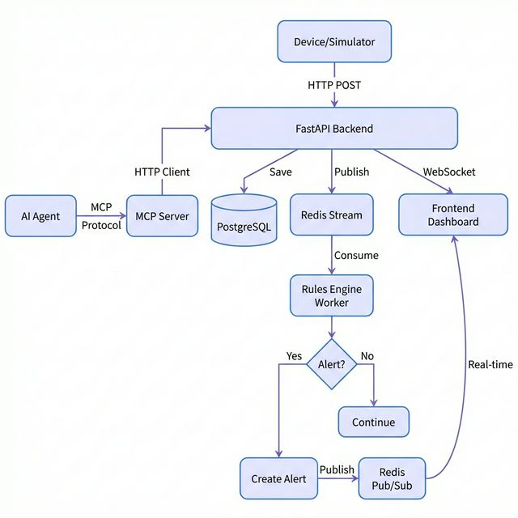

# 🏥 Health Monitor - Real-Time Health Telemetry Platform

A production-ready health monitoring system with FastAPI backend, PostgreSQL storage, Redis-based event streaming, and MCP integration for AI agent interaction.

## 📋 Overview

Health Monitor is an **event-driven health telemetry platform** designed to ingest, process, and analyze vital signs in real-time. The system evaluates health metrics against configurable rules, generates alerts for abnormal readings, and provides both human-facing dashboards and AI-accessible MCP tools.

### Key Features

- ✅ **Real-Time Monitoring**: WebSocket streaming for live vital signs
- ✅ **Intelligent Alerting**: Rules engine evaluates thresholds and triggers notifications
- ✅ **Secure API**: JWT-based authentication on all protected endpoints
- ✅ **Event-Driven Architecture**: Decoupled ingestion from processing via Redis Streams
- ✅ **MCP Integration**: AI agents can query vitals and submit readings
- ✅ **Production-Ready**: Async DB, proper error handling, credential management

## 🏗️ Architecture



### Architecture Flow

1. **Ingestion**: Devices/simulators submit vitals via `POST /vitals`
2. **Storage**: FastAPI saves to PostgreSQL asynchronously
3. **Event Publishing**: Vital published to Redis Stream
4. **Processing**: Background worker consumes stream, evaluates rules
5. **Alerting**: If threshold exceeded → Alert created → Published to Redis Pub/Sub
6. **Real-Time**: WebSocket clients receive live updates
7. **AI Access**: MCP server wraps API for agent interaction

## 🧩 Components

### 1. Backend (FastAPI)

**Location**: `backend/`

**Core Files**:
- `main.py` - API endpoints (auth, vitals, WebSocket)
- `database.py` - PostgreSQL connection with asyncpg
- `models.py` - SQLModel schemas (User, Vital, Alert)
- `auth.py` - JWT authentication (login/register)
- `schemas.py` - Pydantic validation models

**API Endpoints**:
- `POST /auth/register` - Create new user
- `POST /auth/token` - Login (returns JWT)
- `POST /vitals` - Submit vital sign (requires auth)
- `GET /vitals` - Get user's vitals (requires auth)
- `WS /ws/vitals/{user_id}` - Real-time stream

### 2. Rules Engine (Background Worker)

**Location**: `backend/workers/rules_engine.py`

**Functionality**:
- Consumes from Redis Stream (`vitals_stream`)
- Evaluates health rules in real-time
- Generates alerts for abnormal readings
- Publishes alerts to Redis Pub/Sub

**Alert Rules**:
- **Heart Rate**: >120 or <50 bpm → Alert
- **Glucose**: >180 or <70 mg/dL → Alert
- **SpO2**: <90% → Alert

### 3. Frontend Dashboard

**Location**: `frontend/index.html`

**Features**:
- Login/Register UI
- Latest vitals display with metrics
- Active alerts panel with severity levels
- Chart.js for trend visualization
- Responsive glassmorphism design

### 4. MCP Server

**Location**: `mcp-server/server.py`

**Exposed Tools**:
- `login(username, password)` - Authenticate and store token
- `register_user(username, password)` - Create new account
- `get_latest_vitals()` - Fetch recent vitals for authenticated user
- `submit_vital(metric, value)` - Record a vital sign
- `get_vital_trend(metric, limit)` - Analyze trends with statistics

**Integration**: Acts as an HTTP client to the FastAPI backend, wrapping endpoints as MCP tools for AI agents.

## 🗄️ Database Schema

### PostgreSQL Tables

**User**
- `id` (UUID, Primary Key)
- `username` (String, Unique)
- `password_hash` (String)
- `role` (String: patient/doctor/admin)

**Vital**
- `id` (UUID, Primary Key)
- `user_id` (UUID, Foreign Key → User)
- `metric` (String: heart_rate, glucose, spo2)
- `value` (Float)
- `timestamp` (DateTime, Indexed)

**Alert**
- `id` (UUID, Primary Key)
- `user_id` (UUID, Foreign Key → User)
- `metric` (String)
- `message` (String)
- `severity` (String: low/medium/high/critical)
- `created_at` (DateTime)
- `is_active` (Boolean)

## 🚀 Quick Start

### Prerequisites

- Python 3.12+
- Docker (for PostgreSQL and Redis)

### Installation

```bash
cd health-monitor
source venv/bin/activate
pip install -r backend/requirements.txt
```

### Start Infrastructure

**PostgreSQL** (Docker, port 5433):
```bash
docker run -d --name health-monitor-postgres \
  -p 5433:5432 \
  -e POSTGRES_PASSWORD='Postgres@#123$' \
  -e POSTGRES_USER=postgres \
  -e POSTGRES_DB=health_monitor_db \
  postgres:15
```

**Redis** (Docker, port 6379):
```bash
docker run -d --name health-monitor-redis -p 6379:6379 redis
```

### Start Services

**Terminal 1 - FastAPI Backend:**
```bash
cd backend
uvicorn main:app --host 0.0.0.0 --port 8000
```

**Terminal 2 - Rules Engine Worker:**
```bash
cd backend
python workers/rules_engine.py
```

**Terminal 3 - Frontend (Optional):**
```bash
cd frontend
python -m http.server 3000
```
Open: http://localhost:3000

### Test the System

**Simulate Vitals:**
```bash
cd backend
python simulate_vitals.py
```

This will:
- Register a test user (`test_patient`)
- Submit random vital signs every 2 seconds
- Occasionally trigger alerts (abnormal values)

## 🔧 MCP Server Usage

### Start MCP Server

```bash
cd mcp-server
python server.py
```

### Test with MCP Inspector

```bash
npx @modelcontextprotocol/inspector python mcp-server/new_server.py
```

### Example MCP Interaction

```python
# Via AI Agent or Inspector
await login("test_patient", "test123")
await submit_vital("heart_rate", 135)  # Triggers alert
await get_latest_vitals()
await get_vital_trend("heart_rate", 10)
```

## ⚙️ Configuration

### Environment Variables

Edit `backend/.env`:

```env
# Database
DB_USER=postgres
DB_PASSWORD=Postgres@#123$
DB_HOST=127.0.0.1
DB_PORT=5433
DB_NAME=health_monitor_db

# Redis
REDIS_URL=redis://127.0.0.1:6379

# Security
SECRET_KEY=your-secret-key-here
ALGORITHM=HS256
ACCESS_TOKEN_EXPIRE_MINUTES=30
```

## 🧪 Testing

### Manual API Testing

Visit http://localhost:8000/docs for interactive Swagger UI.

### Automated Simulation

The `simulate_vitals.py` script generates realistic data:
- 80% normal values
- 20% abnormal (triggers alerts)
- Metrics: heart_rate, glucose, spo2

## 📚 Tech Stack

| Layer | Technology |
|-------|-----------|
| **Backend** | FastAPI, SQLModel, asyncpg |
| **Database** | PostgreSQL 15 (Docker) |
| **Queue** | Redis Streams |
| **Auth** | JWT (python-jose, passlib) |
| **MCP** | FastMCP |
| **Frontend** | Vanilla HTML/JS + Chart.js |

## 🔐 Security

- **JWT Authentication**: All protected endpoints require Bearer token
- **Password Hashing**: bcrypt via passlib
- **SQL Injection Protection**: SQLModel/SQLAlchemy parameterized queries
- **CORS**: Configure for production deployment

## 🚧 Future Enhancements

- [ ] WebSocket authentication (ticket-based)
- [ ] Alert acknowledgment endpoint
- [ ] ML-based anomaly detection
- [ ] Email/SMS notifications (Twilio)
- [ ] Multi-tenant support
- [ ] Cloud deployment (Railway, Render, AWS)
- [ ] IoT device integration

## 📖 Documentation

- **API Docs**: http://localhost:8000/docs (Swagger UI)
- **ReDoc**: http://localhost:8000/redoc

## 🤝 Contributing

This is a demonstration project showcasing:
- Event-driven architecture
- Real-time data processing
- MCP protocol integration
- Production-ready FastAPI patterns

## 📄 License

MIT License - Feel free to use this as a template for your own health monitoring projects.

---

**Built with ❤️ using FastAPI, FastMCP, and modern Python async patterns.**
